# Ball Sort Puzzle Solver

Use A\* to solve the ball sorting puzzle.

## Setup

To install the project dependencies, run

```
pip install -r requirements.txt
```

This project has 4 Python files that break down as follows:

- `game.py` - this file contains the logic to simulate the ball sorting puzzle game. It also contains functions to generate new games, a few constant example games, and all of our heuristic calculations
- `algorithm.py` - contains the main A\* implementation
- `pickleball.py` - given a number of tubes, tube height, and number of games, generate and pickle a set of game starting configurations
- `run.py` - run and plot results for the set of games produced by `pickleball.py`. Note that there are two subcommands to this script
  - `run.py run` runs the algorithm and saves the explored states and path length for each test game into `results.json`
  - `run.py plot` loads the `results.json` file and plots the resulting curves.
  - The reason for this separation is we recommend running the model using something like `pypy3` which performs much faster than base Python - but `matplotlib` is not compatible with `pypy`, so that section needs to be run with regular Python.

## Background

The Ball Sort Puzzle is a type of logic game popularized in smartphone apps. It involves a number of bins filled with colored balls, and the objective is to rearrange the balls so that each bin contains balls of only one color or is left empty.

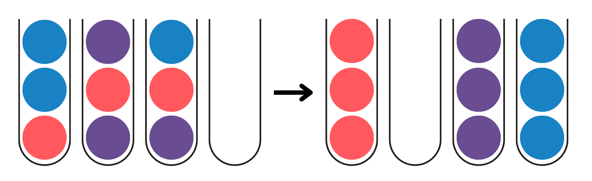

The rules of the game are as follows:

1. Each bin has a fixed maximum capacity, typically equal to the number of balls of a single color.
2. A ball can only be moved if it is the top ball in a bin (following the last-in, first-out principle).
3. A ball can be moved to another bin if the destination bin is either empty or if the top ball of the destination bin matches the color of the ball being moved and the bin is not yet full.

Examples of valid moves:
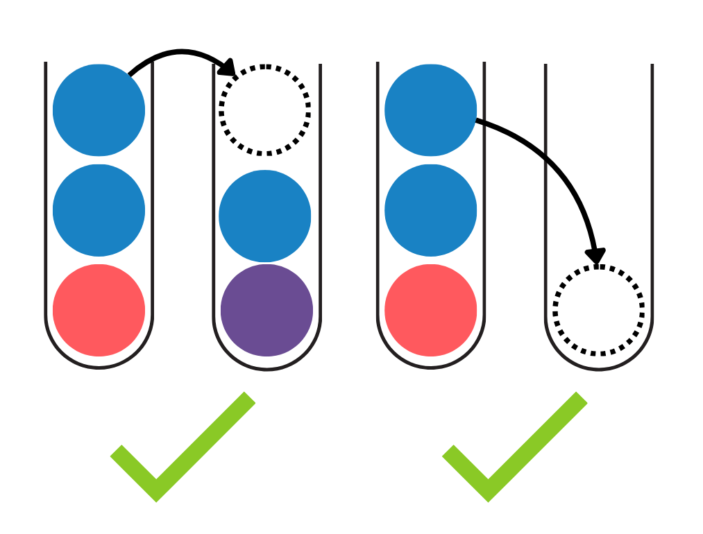

Examples of not valid moves:
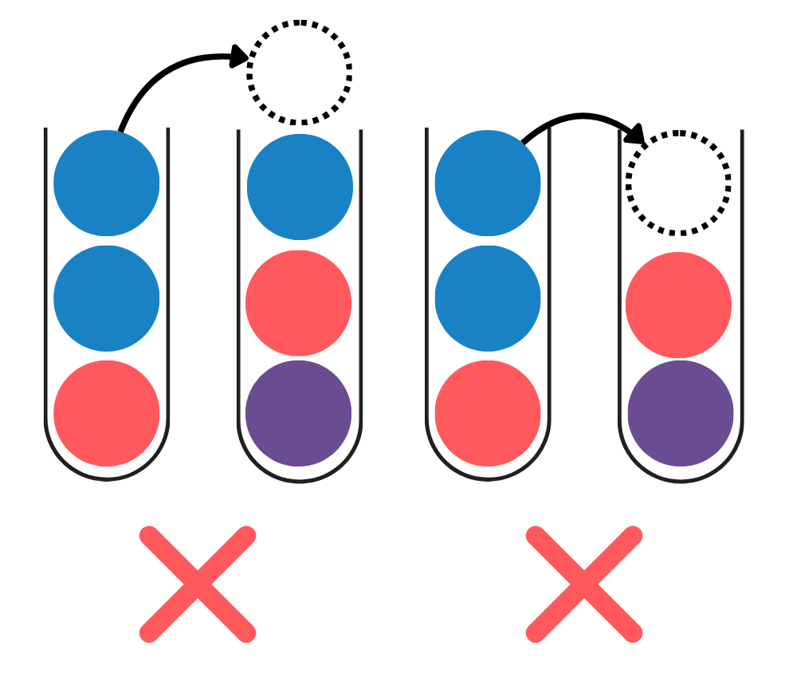

The ball sort puzzle shares some similarities with classic problems like the Tower of Hanoi, requiring careful planning to avoid "locking" balls into unsolvable states.

The ball sorting problem is also an NP-Complete problem - we will go over the proof below.

### NP-Complete Proof

We can prove that the ball sorting problem is NP-Complete by proving its membership in both NP (verifiable in polynomial time) and NP-Hard.

**NP**
Proving this problem is NP is fairly simple - if given a starting position and sequence of moves, we can apply those moves and verify that they the end state is comprised of either monochrome or empty tubes within polynomial time.

**NP Hard**
Proving NP-Hard is where the bulk of the challenge is. If we can reduce another problem into a ball sorting problem, we can conclude the ball sorting problem is as hard as that problem. We can therefore take the NP-Complete problem of 3-Partition, reduce it to a ball sorting problem, and conclude that the ball sorting problem is NP-Complete.

**3-Partition Problem**

The 3-partition problem is a classic NP-Complete problem.

This problem is trying to answer the question - when given a set of integers with length 3m and a target sum of B, can we divide the set into m subsets of length 3 such that the sum of each subset is equal to B? (There is also an additional constraint that each number in the set must be between B/4 and B/2 - this is known as the restricted variant - it is as hard as the unrestricted variant, but will be convenient for us later!)

**Encoding 3-Partition as BSP**

Given a particular instance of a 3-partition problem, we now need to encode it as a sorting problem.

Let's say we have a problem with set of of numbers $[a_1, a_2, a_3...a_3m+1]$, and a target sum B.

We'll define an accompanying 2-color BSP with 3m+1 tubes, with each tube having a capacity of the target sum B. The first 3m bins contain $a_i$ red balls at the top, and $B-a_i$ (the rest) of the balls being blue. The last bin remains empty. In the simplest case of only 3 numbers, that would look like so [1]:

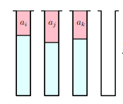

We want to prove that this sorting problem is solvable _if and only if_ the accompanying 3-partition problem is also solvable.

**Proof**

If the 3-partition problem is solvable, than we know that $a_i$, $a_j$, $a_k$ add to B. Therefore, if we were to take the top red balls off of each tube and place them into the empty tube, they would fill it precisely, since the tubes all have a capacity B. At this point, we now have 2B blue balls remaining across our other three tubes, so we can consolidate 2B balls into B tubes, leaving us 2 full tubes of blue balls, 1 full tube of red balls, and one empty tube, which is a solved state! This would scale up to larger puzzles as well - if there were three more red-blue tubes, they'd now have an empty tube to perform the same process over again. That state would look like so [1]:

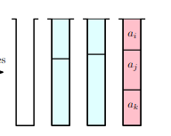

At this point, we have proven that if a 3-partition is solvable, than the accompanying sorting problem is solvable - now we need to prove that that sorting problem is only solvable if the 3-partition is solvable - in other words, there's no way to circumvent the rules and solve the sorting puzzle outside of the 3-partition ruleset/paradigm we have defined for ourselves - for example, we fill one of our tubes by with the balls from only two red tubes.

This is where using the restricted version of the 3-partition comes in handy! By restricting our integer elements to between B/4 and B/2, it ensures that we can only reach our target sum in sets of three - if we only have two elements, and they are both less than half of B, we can't possible reach B. Similarly, if we have 4 elements and they are all over a quarter of B, the sum will forcibly be higher than B - we must use a set of three elements from our set (or tubes' worth of red balls) to create our target sum.

> You might be thinking - what if I combine red balls from different tubes to circumvent the rules? This would indeed not accurately represent the constraints of 3-partition. However, this proof is being performed on the water sorting problem - a similar problem to ball sorting except for that the units of water cannot be separated once they are neighboring the way the balls can. Source [1] contains additional info for why the BSP and WSP problems have equivalent complexity and can be substituted here.

At this point, we've proven that the ball sorting problem is verifiable in polynomial time, and we've reduced a separate NP-Complete problem to it, so we have now proven that the ball sorting algorithm is also an NP-Complete problem.

### Algorithm

Our solver uses the A* algorithm to find the optimal sequence of moves— that is, the shortest series of legal moves — needed to solve any given starting configuration. We apply the A* search algorithm, a pathfinding and graph traversal technique known for its efficiency in finding the least-cost path to a goal. A\* considers both:

- The cost so far (the number of moves made) and
- A heuristic estimate (an estimate of how many additional moves may be needed to reach the solved state).

Unlike simpler search methods like Dijkstra's algorithm, which only considers the cost to _reach_ a given path (which in this case is equal to the depth!), the addition of a heuristic allows A* to prioritizes both paths that are cheap to take *and\* are likelier to converge on a solution quicker.

## Application to Ball Sorting

Being that A\* is a graph traversal algorithm, we had to do some translation to map graph elements to game representation in order to apply the algorithm, since we don't have a precomputed graph of each possible game state.

1. Node -> Game State - We used a custom Python class to represent our game state, consisting of primarily a list of lists of variants of a Color enum. The class also includes some useful helper functions that allow us to validate and perform moves, check for win conditions, and evaluate various heuristic metrics about each state.

2. Edge -> Legal Game Move - At each node/game state, we find all of the potential neighbors by analyzing the set of all possible moves.

3. Edge Weight -> A\* is theoretically supposed to be performed on a weighted graph. However, in this case, every move has the same cost - each move adds 1 to the number of moves, so all of our edge weights on our graph are taken to be a constant 1.

Additionally, there are a few other elements we had to implement:

- A\* requires us to choose at each iteration the state with the lowest estimated cost (depth + heuristic). We used Python's heap queue for this in order to try and minimize the cost of loading and storing from the sorted list.
- Each state additionally tracks a little bit of metadata about itself - primarily its parent, and the move that led up to it - to allow us to later reconstruct the solution path.
- Lastly, we track which states have been popped off of our priority queue with a Python `set` to ensure we don't visit a state multiple times.

#### A\* Algorithm Pseudocode for Ball Sorter

1. Initialize a priority queue (min-heap) and insert the initial game state node with its heuristic score.

2. While the queue is not empty:

   - Pop the node with the **lowest estimated cost** (most promising state).
   - If this node represents a **solved game state**:
     - Reconstruct the path of moves by following the parent pointers.
     - Return the path.
   - If it’s **not solved**:
     - Generate all valid next moves (neighbors).
     - For each neighbor:
       - Apply the move to create a new game state.
       - If this state hasn’t already been explored:
         - Calculate its `g` (cost so far) and `h` (heuristic estimate to goal).
         - Add it to the priority queue.

3. If the queue is exhausted without finding a solution:
   - No valid sequence of moves exists from the initial game state.

Example of neighbor creation and cost evaluation:
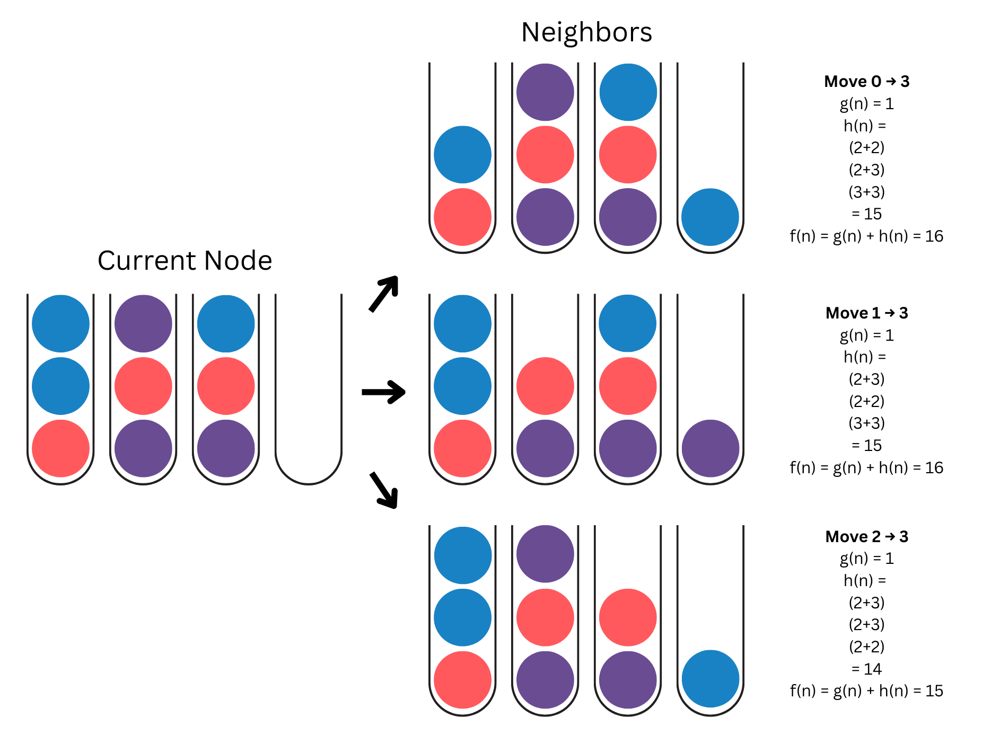

#### Heuristic Design

One of the core strengths of the A* algorithm is its use of an estimated cost to reach the goal. To apply A*, we need a heuristic function that can reasonably predict how many moves remain from any given game state to the solved state.

However, unlike traditional pathfinding problems, this game doesn’t use a literal graph with spatial coordinates. So, standard distance metrics like Manhattan or Euclidean distance don't apply. Instead, we must design heuristics based on the structure and properties of the game state itself. This poses a unique challenge, as many factors influence how “difficult” or "far" a state is from being solved.

Here are some of the heuristics we explored:

1. Unique Colors per Column

   A simple approach is to count the number of unique colors in each column. The more colors in a column, the more moves are generally needed to separate them. This heuristic provides a decent baseline but has some limitations. It doesn't account for partially solved columns (e.g., a column that already has a few balls of the same color stacked but is not at the bin capacity) or the position of colors in the stack.

2. Color Transitions

   This heuristic counts how often the color changes from one ball to the next in a single column. A column with fewer color transitions (e.g., red-red-red-blue) is typically easier to solve than one where colors alternate frequently (e.g., red-blue-red-blue). The idea is that smoother blocks of the same color require fewer moves to sort.

3. Misplaced Balls

   Another approach counts the number of balls in each column that do not match the majority color in that column. The intuition is that a column with mostly red balls is more likely to become a red column, so any other colors are considered misplaced and will likely need to be moved. However, this heuristic can be misleading if the majority color is blocking the other colors below it, requiring more moves than expected. To counter this, we added weights to this heuristic where non-majority balls get penalized more the lower they are in the stack.

4. Weighted Combination: Unique Colors + Length

   We also experimented with a composite heuristic that adds the number of unique colors and the total number of balls in a column. The reasoning here is that longer, more diverse columns typically take more moves to sort. This heuristic attempts to capture both the complexity of color distribution and the effort required to clear a column.

## Results/Analysis

From our initial heuristic ideas, we attempted to run them on a control set of games with the following parameters

- Number of Tubes: 10
- Tube Capacity: 4
- Number of Games: 20

The unique colors and color transitions heuristics were quickly ruled out, as they explored far too many states and took excessively long to return a result. In contrast, the weighted variant of the misplaced balls, as well as the unique colors per tube + lengths were the ones that were successfully able to find solutions for all 20 of the games (note that both of these were combined with an element that penalizes tubes with remaining space in them, so as to be able to differentiate between solved and unsolved states when all tubes are monochrome). The results are plotted below - the first chart plots the number of states that the solver explored when employing that heuristic, and the second is the length of the solve path that was found.

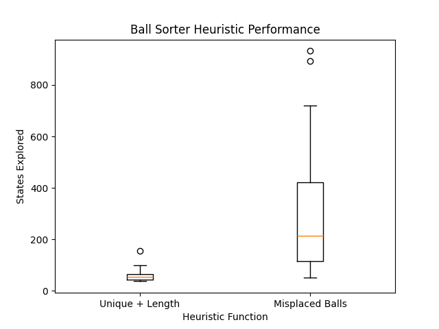

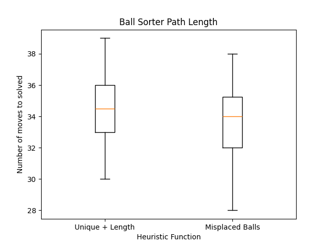

Along with some descriptive statistics:

**States Explored**

| Statistic | Unique Colors | Misplaced Balls |
| --------- | ------------- | --------------- |
| Mean      | 60.45         | 321             |
| Median    | 54.5          | 213.5           |
| Std Dev   | 27.49         | 269.61          |

**Path Length**
| Statistic | Unique Colors | Misplaced Balls |
| --------- | ------------- | --------------- |
| Mean | 34.65 | 33.75 |
| Median | 34.5 | 34 |
| Std Dev | 2.41 | 2.75 |

Both of these heuristics performed relatively well, however the unique colors comes out on top here - it was able to achieve nearly the same performance in terms of path length (median of ~34), but by exploring only about a quarter of the number of states that the misplaced balls heuristic needed to. It was also much more consistent, with a standard deviation of about half of it's median states explored, compared to nearly 120% for the misplaced balls.

To explore the unique balls heuristic in more depth, we conducted a parameter sweep for the weights applied to the unique color penalty and the column length penalty. We observed that weights below 0.5 or above 1 resulted in significantly longer runtimes and became impractical. As a result, we focused our sweep within the [0.5, 1.0] range.

Below are plots showing the impact of column length weight on the number of states explored and the number of moves in the solution path:
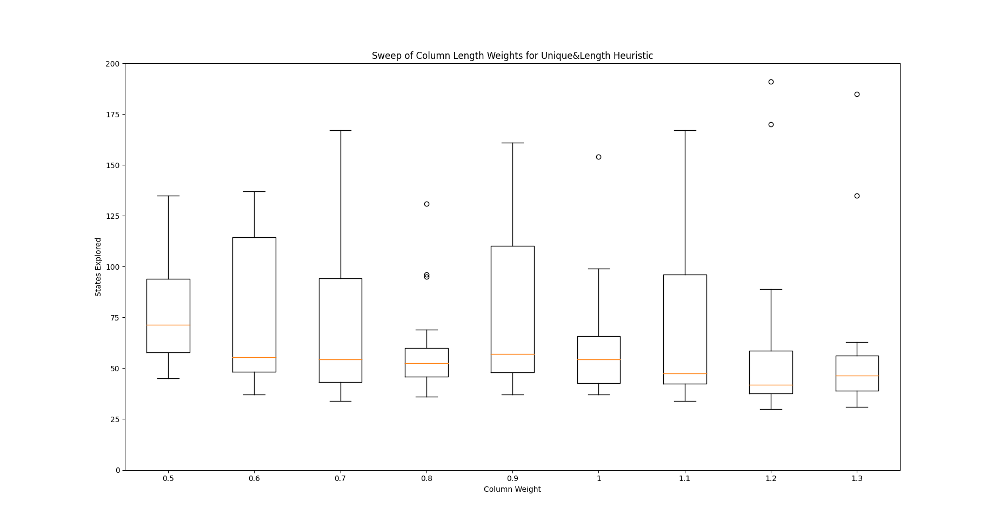
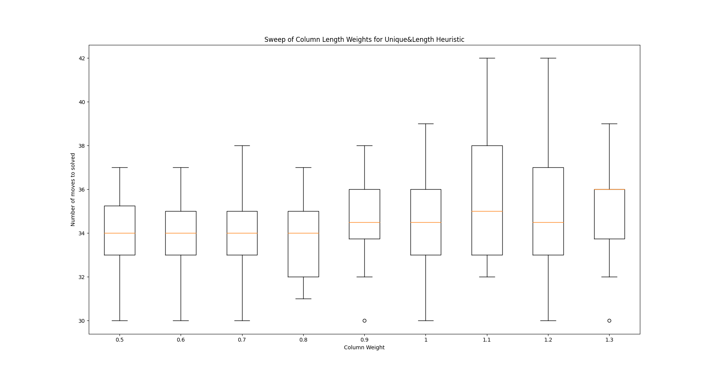

The following plots show the effect of varying the unique color weight:
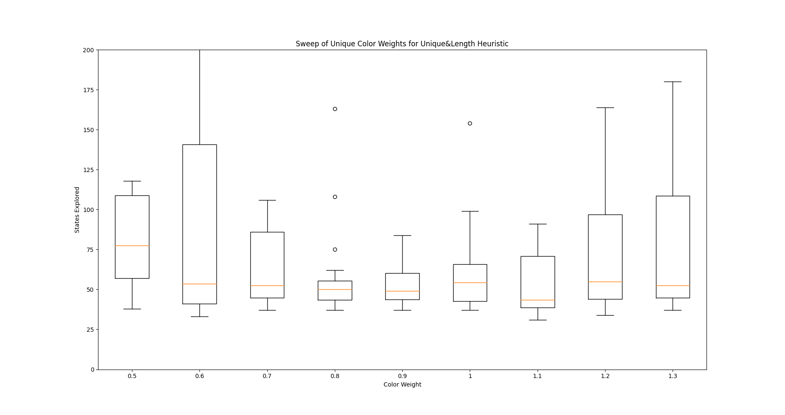
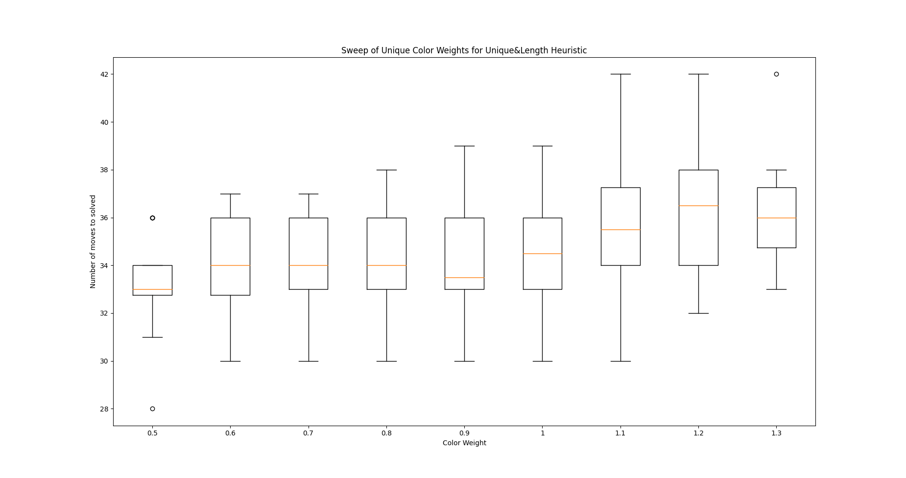

Our results indicate that while there is a clear performance drop-off outside the 0.5–1.0 range, the performance within that range remains fairly consistent. For this set of puzzles, weight adjustments within that interval did not lead to significant differences in outcome.

## Next Steps

This initial exploration showed a lot of promise, and there are certainly avenues for improvement we are excited about.

1. Heuristic Design - One of the things we realized over the course of the course of this project was that it was very difficult to intuitively compare different heuristics to each other and predict which one was better without implementing and testing it, which was an expensive process both computationally, and in terms of implementation time. As a result, this limited the number and variety of heuristics we were able to try, and ultimately we feel there's still lots of available exploration in this space to improve the algorithm performance.

2. Algorithm Efficiency - When we wrote the algorithm, we optimized for factors like readability, development time, and reliability, as we wanted to minimize the number of code/implementation hurdles we ran into in order to focus on our more conceptual learning goals. However, this trade-off was made primarily at the cost of efficiency - our algorithm runs quite slowly relative to the number of states it is exploring, which limited the number and complexity of the puzzles we were able to test. With more time, we believe there's plenty of opportunity to optimize our data structures and our algorithm implementation to tackle more complex variants of this puzzle.

3. Water Sorting? The ball sorting puzzle is one of two popular variants of this genre of puzzle, the other being the water sorting puzzle, which has the key difference that when one unit of water (vs a ball) is poured onto another of the same color, they join and become a 2 (or more) tall unit that must move as one. It'd be interesting to see how well our algorithm handles water sorting as opposed to ball sorting.

## Citations

[1] T. Ito, “Sorting Balls and Water: Equivalence and Computational Complexity,” Feb. 19, 2022.
